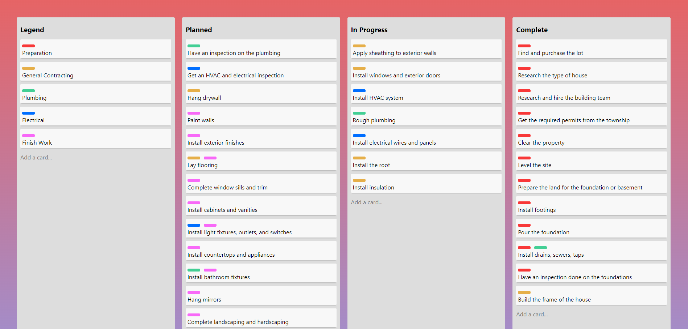

<h2 align="center">Task Board</h2>
<a href="https://stephnicoledev.github.io/task-board/"><a/>
    
This is a project that mimics a Kanban-style list-making application such as <a href="https://trello.com/">Trello</a>.
 
  This project is for learning purposes only.

<a href="https://stephnicoledev.github.io/task-board/"><strong>Live Site</strong></a>

## How It's Made:

**Tech used:** HTML, CSS

- Utilized CSS Flexbox and Grid to ensure a responsive design.

## Improvements To Make:

- Arrange lists in a column for mobile devices.
